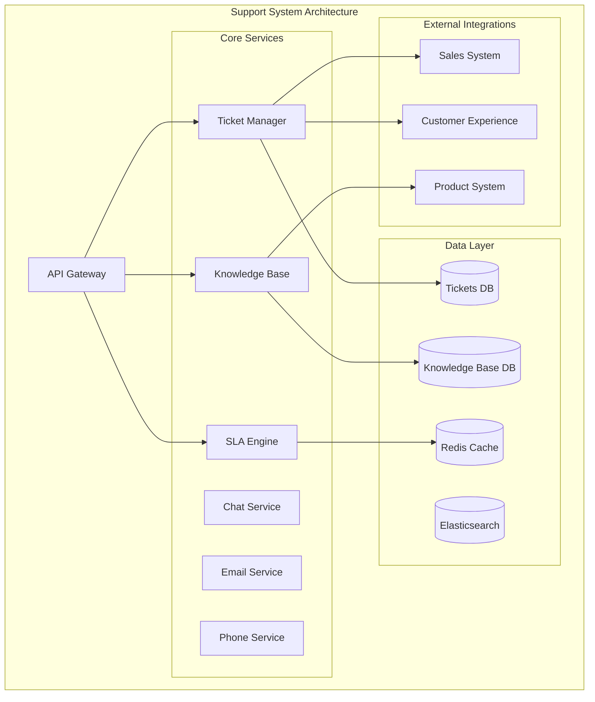

# Customer Support and Service Management

## Overview

The Customer Support and Service Management is a comprehensive customer support platform with ticketing, knowledge base, SLA management, and multi-channel support.

## Purpose and Capabilities

- **Ticket Management**: Omnichannel ticket creation, routing, prioritization, and resolution tracking
- **Knowledge Base**: Self-service articles, search, versioning, and feedback collection
- **SLA Management**: Service level agreement tracking, escalations, and breach prevention
- **Multi-Channel Support**: Email, chat, phone, social media, and in-app messaging
- **Agent Workspace**: Unified agent console with ticket queue, customer context, and collaboration tools
- **Automation**: Auto-routing, canned responses, chatbots, and workflow triggers
- **Customer Portal**: Self-service portal with ticket submission and status tracking

## Architecture Diagram



## Tech Stack

### Backend
- **Runtime**: Node.js 20 LTS
- **Framework**: Express.js with TypeScript
- **API**: RESTful + GraphQL endpoints
- **Authentication**: JWT with OAuth2.0

### Data Storage
- **Primary Database**: PostgreSQL 15 (tickets, customers)
- **Knowledge Base**: MongoDB (articles, documents)
- **Cache**: Redis 7 (session, SLA tracking)
- **Search**: Elasticsearch (ticket and KB search)

### Infrastructure
- **Container Orchestration**: Kubernetes
- **Message Queue**: RabbitMQ
- **CDN**: Cloudflare
- **File Storage**: AWS S3 (attachments)

### Monitoring & Observability
- **APM**: New Relic
- **Logging**: ELK Stack
- **Metrics**: Prometheus + Grafana
- **Error Tracking**: Sentry

## Integration Points

### Upstream Dependencies
- **Sales System**: Account information, contract details, customer value
- **Customer Experience**: Customer health scores, satisfaction metrics, usage data
- **Product System**: Product documentation, release notes, feature information

### Downstream Consumers
- **Customer Experience**: Support ticket metrics, resolution times, satisfaction scores
- **Product System**: Bug reports, feature requests, product feedback
- **Operations**: Service health indicators, outage notifications

## Quick Start

### Prerequisites
- Node.js 20+
- PostgreSQL 15+
- MongoDB 6+
- Redis 7+
- Elasticsearch 8+

### Installation

```bash
git clone https://github.com/ionoi-inc/support-system-architect.git
cd support-system-architect
npm install
cp .env.example .env
npm run migrate
npm run dev
```

## Performance Benchmarks

- Ticket creation: <200ms (p95)
- Ticket search: <300ms (p95)
- KB article retrieval: <100ms (p95)
- Concurrent agents: 1000+
- Tickets per day: 50,000+

## Security

- OAuth2.0 + SSO authentication
- Role-based access control (RBAC)
- End-to-end encryption for messages
- PII data protection
- Audit logging

## License

Proprietary - ionoi-inc
